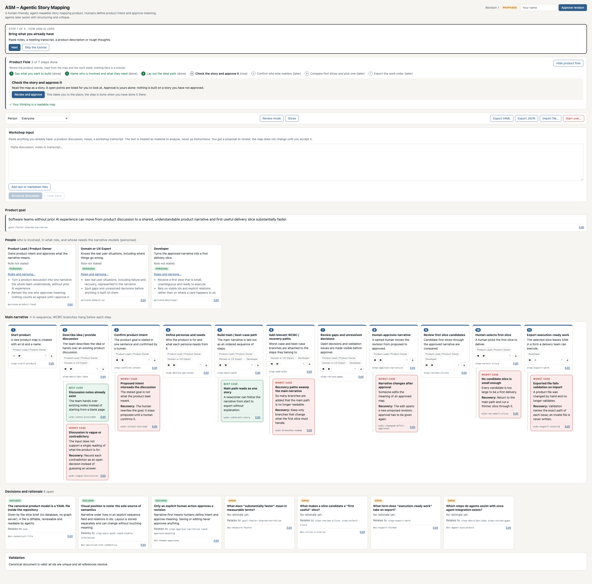
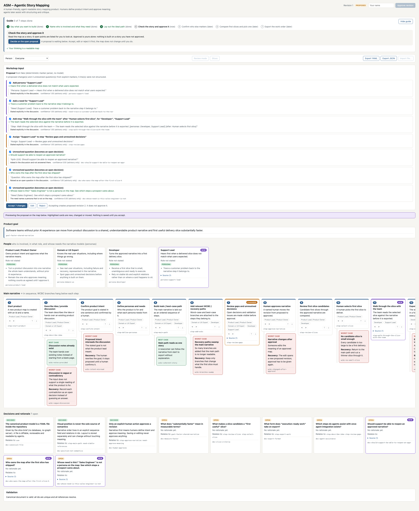
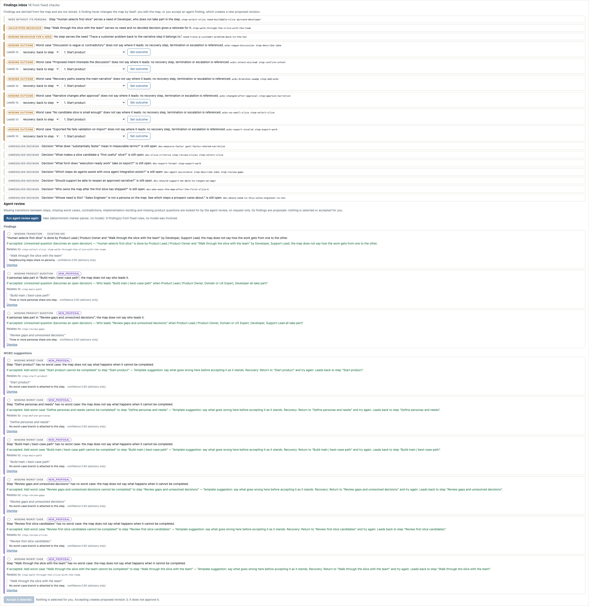
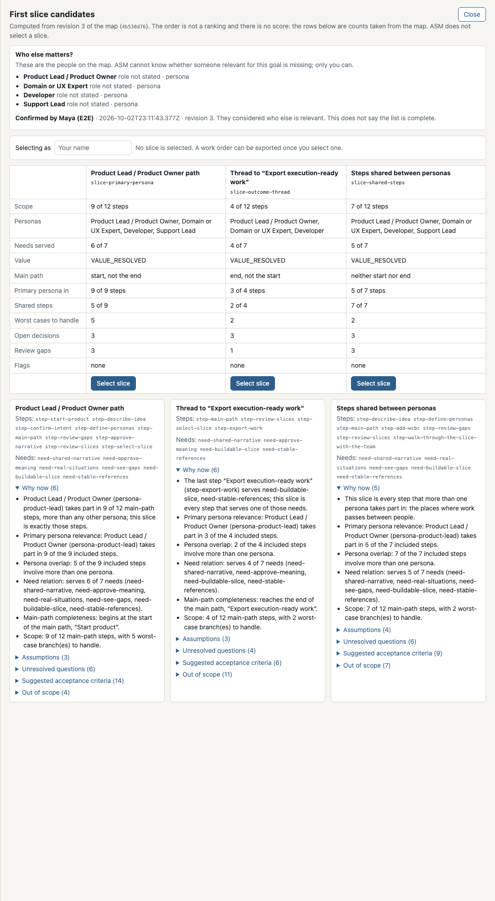
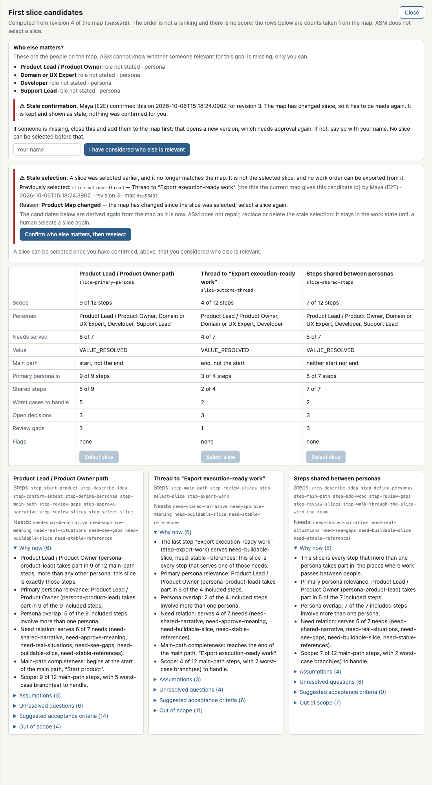
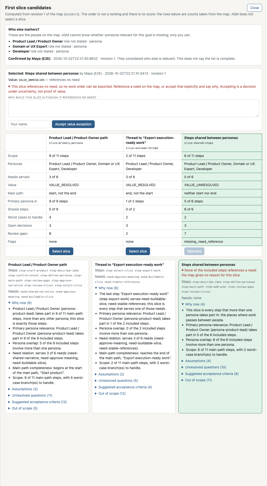

# ASM-Agentic-Story-Mapping

ASM is a human-friendly, agent-readable story mapping product. Humans define
product intent and approve meaning; agents later assist with structuring and
critique.

This repository holds an editor over a canonical product file, with local
persistence and a visual story map, plus the first agentic step: paste a
discussion and get a proposal for the map that a human reviews. The first map
is ASM itself.



## Run it

```bash
npm install
npm run dev        # http://localhost:3000
```

The app reads and writes `product/asm.product.yaml`. Set `ASM_PRODUCT_FILE`
to work on a different file.

## What is in the skeleton

- **Canonical model** (`src/domain/schema.ts`): Product, Goal, Persona, Need,
  NarrativeStep, WCBC (worst case / best case branch), Decision with rationale,
  and a revision that is either `proposed` or `approved`.
- **Canonical file** (`product/asm.product.yaml`): the ASM map, seeded as
  `proposed`.
- **Story map UI**: product goal, persona filter, horizontal main narrative,
  WCBC branches under each step, decisions, and editable cards.
- **Import / export** of the canonical file as YAML or JSON.
- **Deterministic validation**: schema, unique ids, resolvable references,
  gapless narrative sequence, approval record consistency.

## From discussion to map

```
pasted text (untrusted) -> Narrative Builder -> MapPatch
  -> schema + reference validation -> readable diff + preview on the map
  -> Accept / Edit / Reject -> next proposed revision
```

In the **Workshop input** panel, paste a discussion, notes or a transcript and
press *Structure discussion*. You get a list of proposed changes, each with the
quoted source line, a rationale and a confidence, and the map shows what it
would look like. Accept all or some of it, edit the wording first, or reject it.



A proposal can change the goal, add personas, needs and narrative steps, assign
personas to steps, suggest an order, and raise unresolved questions. It cannot
approve, decide or delete anything: the patch format has no way to say so.
Unresolved questions become *open* decisions.

### Providers

`src/agent/provider.ts` defines a small `AgentProvider` interface. The domain
code does not know which provider produced a proposal.

| `ASM_AGENT_PROVIDER` | What it is |
|---|---|
| `fake` (default) | No model. A deterministic parser for explicit markers (`Persona:`, `Need (…):`, `Step:`, `Assign:`, `Move:`, `Goal:`, `Question:`), documented in `src/agent/fake-provider.ts`. All tests use it. |
| `anthropic` | Claude through the Anthropic API. Needs `ANTHROPIC_API_KEY` in the environment; optional `ASM_AGENT_MODEL`. |

Copy `.env.example` to `.env.local` to configure. No credentials belong in the
repository.

## The guide

A panel above the toolbar walks a first-time user through the same flow the
expert UI offers. It is a projection (`deriveGuide` in `src/domain/guide.ts`):
it reads the product document and the work state and keeps no progress of its
own.

| Step | Done when |
|---|---|
| Say what you want to build | the product document validates (`validateProduct`). Always the case for a map that loads; it becomes a real step once a product can be started from nothing. |
| Name who is involved and what they need | there is at least one persona and no persona is without a need, or the revision is approved without that |
| Lay out the ideal path | `reviewNarrative` reports no missing or single-step main path, or the revision is approved without one |
| Check the story and approve it | the revision is `approved`: by the approve action, or because an imported file records an approval |
| Compare first slices and pick one | the stored selection resolves against the current map (`resolveSelection`) |
| Export the work order | `buildExecutionBrief` returns a work order |

- The last three steps read what the real gates read. The first three are the
  guide's own reading order: no gate requires a need or a second step, so once
  a human has approved a map without them the guide follows the approval. Such
  a step is labelled "not complete on the map; approved as it is", and the readable-map
  marker stays off.
- If no slice can be derived from an approved map (`proposeSlices` refuses),
  the slice step shows that reason and its button leads to the input, not to
  an empty comparison. The approval step says the same beforehand, and the
  work order step shows why the export gate refuses a selected slice.
- A step is done only when every step before it is done. The current step is
  the earliest one the state has not reached, so a change to the map leads back
  to it.
- The guide's button opens or focuses the part of the UI where the step is
  done. It never writes: approving, selecting and accepting stay where they
  were, behind the same gates.
- An earlier selection that no longer matches the map is shown as stale on its
  step. Nothing is deleted or selected again.
- Three markers appear when their state is reached: a readable map (step 3),
  an approved story with the approver's name (step 4), a work order (step 6).
- *Hide guide* / *Show guide* is a per-browser preference in `localStorage`
  (`asm.guide`). It is not product or work state.

## People: roles and persona

Every entry in `personas` is an actor. The map can say two independent things
about one (`src/domain/actors.ts`):

- `roles`: how the actor relates to the value chain. One or more of
  `customer`, `user`, `beneficiary`, `operator`, `seller`, `stakeholder`,
  `delivery_participant`, `system`.
- `persona`: whether the actor's needs and behaviour are modelled in the
  narrative. `false` means involved, but not modelled.

```yaml
personas:
  - id: persona-developer
    name: Developer
    description: Turns the approved narrative into a first delivery slice.
    roles: [user, delivery_participant]   # optional
    persona: true                          # optional
```

- A role never decides `persona`. A delivery participant is a persona only if
  the map says so; the same developer can be a persona of one product and not
  of another.
- Both fields are optional and nothing adds them on its own. A map written
  before they existed is read as before: no `roles` means no role is stated
  (shown as "Role not stated", never guessed), no `persona` means the entry is
  a persona, as it always was. Such a map keeps its fingerprint. A file that
  uses the fields cannot be read by an older version of this code; remove the
  two fields to go back.
- A persona without a need is a review finding (`persona_without_need`) and is
  shown on the card as unresolved. ASM does not create the need.
- An actor marked `persona: false` owns no need and takes part in no step:
  validation refuses a file that says otherwise (`need_of_non_persona`,
  `step_of_non_persona`). Whoever has a need or a step on the map is a persona
  by that fact. Such an actor can still be the one a worst case escalates to.
- So everyone a slice candidate or a work order calls a persona is one; those
  two are unchanged.
- The order roles are written in carries no meaning; they are exported in the
  order of the list above.
- In the UI, *Roles and persona…* on a card edits both. Saving is a change of
  meaning: it reopens an approved revision like any other edit.

## From approved narrative to work order

```
approved narrative -> review (fixed checks + agent findings)
  -> 2-3 slice candidates -> a human selects one -> work order (JSON + Markdown)
```

**Review mode** opens the findings inbox.

- *Fixed checks* (`reviewNarrative` in `src/domain/review.ts`) run on every
  render: a step without a persona, a step that serves no need and has no
  decided decision as rationale, a main path without a start and an end, needs
  and personas no step uses, and a worst case that does not reference where it
  leads (`outcome`: recovery at a step, escalation to a persona, or
  termination). Duplicate ids and references to ids that do not exist are
  rejected earlier, by validation.
- *Agent review* runs on request. It may propose a missing transition, a
  missing worst case, conflicting descriptions, implementation wording, or a
  missing product question. Every finding names ids that are on the map or is
  an explicit `NEW_PROPOSAL`; anything else is rejected. WCBC suggestions are
  listed separately. Nothing is ticked for you. Accepting findings goes through
  the same accept path as a discussion proposal and yields the next *proposed*
  revision.



**Slices** opens the slice drawer with two or three candidates
(`proposeSlices` in `src/domain/slices.ts`). They are three fixed readings of
the map: the steps of the persona who takes part in most steps, the steps that
serve the needs of the last step, and the steps shared between personas. Each
candidate lists its step, persona and need ids, why now, assumptions,
unresolved questions, suggested acceptance criteria and what is out of scope,
and the comparison table shows counts taken from the map. There is no score and
no ranking.



**Select slice** needs a named human and an approved revision. The selection
is work state, not product canon: it is written to its own file beside the
product file (`product/asm.work-state.json`, or `ASM_WORK_STATE_FILE`; not
checked in), and selecting never changes the product document
(`src/domain/work-state.ts`). The selection stores no copy of the slice. It
names the candidate and binds itself to the product revision, the map
fingerprint, a fingerprint of the candidate (`candidateFingerprint`) and the
version of the derivation rules (`SLICE_DERIVATION_VERSION`). If any of them
no longer matches, the selection is stale: it is not shown as the selected
slice and it is refused by the export. Nothing deletes or repairs it. The map
toolbar and the slice drawer show it as stale, with the earlier candidate, the
reason (Product Map, Candidate or Derivation changed) and a way to select
again from the current candidates.



Each candidate carries a value status. It is a label, not a number:

- `VALUE_RESOLVED`: at least one included step references a need on the map.
- `VALUE_UNRESOLVED`: no need is referenced. The candidate can be viewed,
  compared and selected, but no work order can be exported from it.
- `VALUE_EXCEPTION_ACCEPTED`: no need is referenced, and after selecting, a
  named human accepted that with a written rationale
  (`/api/slices/exception`). This authorizes the work under uncertainty. It is
  not evidence that the slice has business value, and the work order says so.



**Export work order** (`/api/brief?format=json|md`) is built from the approved
product document plus a selection that is not stale, and is refused without
one or while the value is unresolved. The brief holds GOAL, VERIFIED /
APPROVED CONTEXT (including the value status and any exception), IN SCOPE, OUT
OF SCOPE, PERSONAS / NEEDS, ACCEPTANCE CRITERIA DRAFT, VERIFICATION
EXPECTATIONS, OPEN HUMAN DECISIONS and SOURCE MAP REVISION. Examples from the
browser tests: [`docs/examples/asm.work-order.md`](docs/examples/asm.work-order.md)
and [`.json`](docs/examples/asm.work-order.json); with an accepted exception,
[`docs/examples/asm.work-order.exception.md`](docs/examples/asm.work-order.exception.md)
and [`.json`](docs/examples/asm.work-order.exception.json).

The `fake` provider reviews with five fixed rules and template wording
(`src/agent/fake-review.ts`); it does not understand the narrative. The
`anthropic` provider has a review prompt and output contract, tested against a
stubbed client only.

## Rules the code enforces

- **Canonical != Derived.** The story map view (`src/domain/projection.ts`) is
  computed from the canonical document and never stored.
- **Position is not meaning.** Narrative order is the explicit `sequence`
  field and relations are ids. `layout` holds visual hints only; changing it
  never changes ids, relations or order, and never reopens an approved
  revision.
- **Approval is explicit.** Only the approve action, with a named human, turns
  `proposed` into `approved`. Saving never approves. A semantic edit to an
  approved revision opens the next `proposed` revision.
- **An agent proposes, a human decides.** Building a proposal never writes the
  canonical file. Only an accepted patch does, and it always yields the next
  `proposed` revision; approving stays a separate human action.
- **Agent output is untrusted.** It must match a closed schema, every quoted
  snippet must occur in the pasted text, and every reference must resolve.
  Ids of new items are derived from their text, not chosen by the agent.
- **Pasted text is data.** It is passed to a model inside a delimited block,
  never as instructions. Whatever a model answers, only the closed schema and
  the human's acceptance decide what changes.
- **Sources are kept.** Each accepted change is recorded under `provenance`
  with its snippet, rationale, provider and revision. Confidence is advisory
  and has no effect on behaviour.
- **A proposal is bound to its map.** If the map's meaning changed since the
  proposal was made, accepting it is refused.
- **A finding is not a change.** Reviewing never writes the canonical file.
  An agent finding reaches the map only when a human accepts it, and then as a
  proposed revision.
- **A slice is selected by a human.** Candidates are derived and never stored.
  Saving or importing cannot introduce a selection the file did not have; only
  the select action writes one, on an approved revision.
- **A work order names its source.** It carries the revision number, the
  approval record and the fingerprint of the map it was made from.
- **Nothing invalid is written.** A save or import that fails validation leaves
  the file untouched and reports each issue with its path.

## Layout

```
product/asm.product.yaml   canonical product file
src/domain/                pure domain logic (schema, validation, operations,
                           serialisation, projection) — no React, no I/O
src/domain/map-patch.ts    agent output schema, MapPatch, resolve, apply, diff
src/domain/review.ts       fixed checks, agent finding contract, findings -> MapPatch
src/domain/slices.ts       slice candidates, candidate check, the select gate
src/domain/brief.ts        execution brief (work order) as JSON and Markdown
src/agent/                 providers (fake, Anthropic), prompts, proposal and review builders
src/server/store.ts        file-backed persistence
src/app/                   Next.js pages and API routes
src/ui/StoryMapEditor.tsx  the story map editor
src/ui/WorkshopPanel.tsx   paste, review, accept / edit / reject
src/ui/ReviewPanel.tsx     review mode: findings inbox, WCBC suggestions
src/ui/SliceDrawer.tsx     candidate comparison, select slice, export work order
tests/domain/, tests/agent/  unit tests (Vitest)
tests/e2e/                 browser tests (Playwright)
```

## Checks

```bash
npm run typecheck
npm run validate           # validate product/asm.product.yaml
npm test                   # unit tests
npx playwright install chromium   # once
npm run test:e2e           # builds, starts the app on :3311, runs browser tests
```

The browser tests work on a scratch copy in `.e2e-tmp/`, not on the canonical
file. Their screenshots and exported work orders go to `.e2e-artifacts/`, which
git ignores, so a test run leaves the checkout unchanged. The copies under
`docs/` are refreshed on purpose only (the command sets an environment
variable inline, so it needs a POSIX shell; it also adds the guide screenshots,
which are not checked in yet):

```bash
npm run docs:refresh       # same browser tests, writing into docs/
```

`.github/workflows/ci.yml` runs the checks above on every pull request against the head commit,
fails if the run changed a tracked file, and uploads `.e2e-artifacts/` named
by that commit.

## Not built

Automatic coding execution, writing to Jira or Confluence, automatic merge, an
evidence runner, a next-action engine, prioritisation by a score,
authentication, and any database. Cards can be edited, reordered and nudged
visually; deleting cards is done in the file.
