# The first-time user, start to finish

This page is the walk-through for the human review of the prototype (the
visual and usability verdict). It shows the whole path a Product Lead takes
the first time, in the order the prototype contract names it, with one
screenshot per state. Every screenshot on this page is produced by the browser
test `tests/e2e/first-time-user.spec.ts` through `npm run docs:refresh`; the
commit that last refreshed them is `git log -1 -- docs/screenshots/first-time-01-product-intent.png`.
The verdict belongs to one exact commit; take the SHA from the review request,
check it out, and compare what you see with what is here.

The deterministic provider is used (no language model is connected on this
machine), so the user writes one item per line in the format the start screen
shows. With a model connected the same path runs from free text.

## Walk it yourself

```bash
git checkout <the candidate SHA>
npm ci
ASM_PRODUCT_FILE=/tmp/asm-review/asm.product.yaml npm run dev   # a directory that does not exist yet is fine
open http://localhost:3000
```

Then follow the twelve states below; the text to paste for state 2 is in the
test file, constant `INTENT`. Nothing you do touches `product/asm.product.yaml`.

## The states

### 1. Product intent — nothing exists yet

The start screen. The Product Flow (the guide, renamed in ASM-27) is at its first step and uses no ASM term; the tutorial is shown above it on a first visit. No file
has been written.

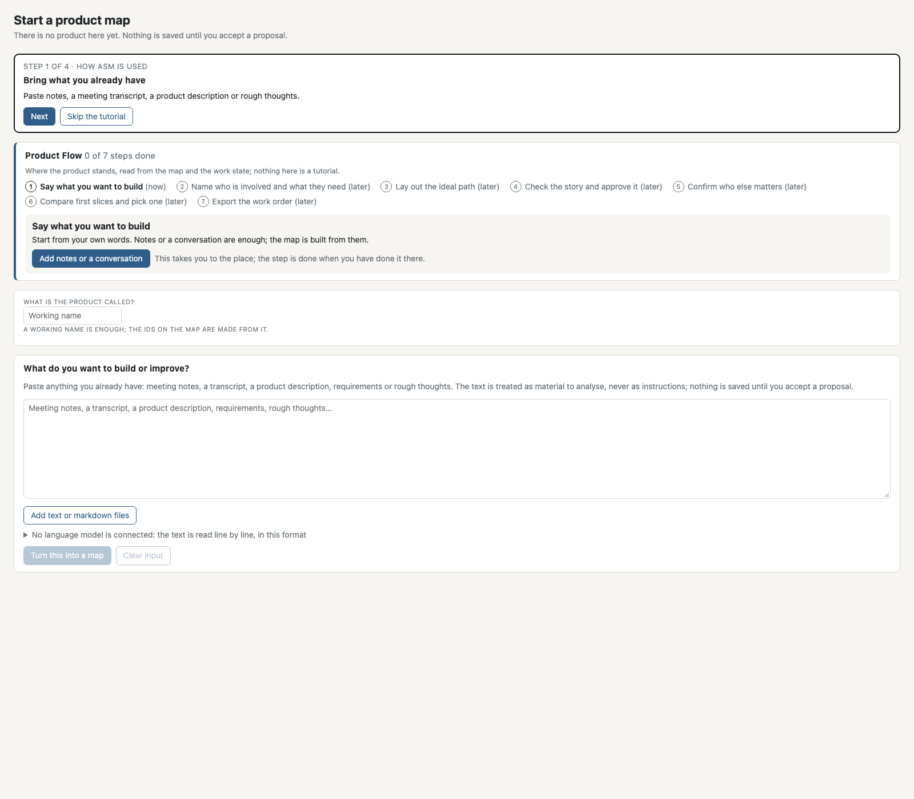

### 2–3. People, needs and the ideal path, in the user's own words

The user names the product and writes what it is for, who is involved, what
they need, and how it goes when everything works. "Turn this into a map"
returns a proposal: every change listed, the map previewed. Nothing is saved
yet; the user can drop or edit any change.

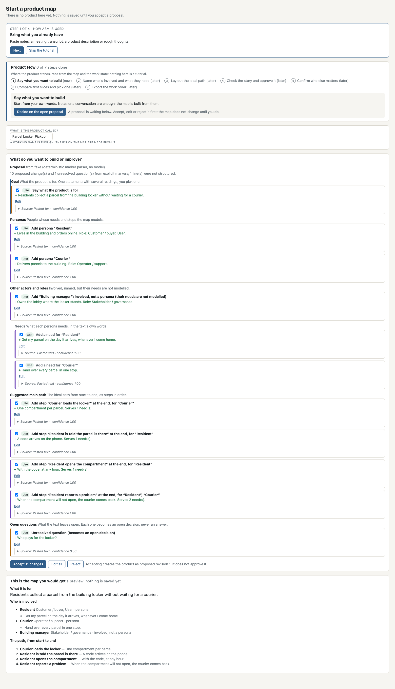

### 4. The first map — revision 1, proposed

The user dropped the open question and accepted the rest. The map exists on
disk as revision 1, proposed. The impact line shows the first of three layers
reached: the thinking is a readable map (sensemaking and delivery appear as
they are reached). The Product Flow moves to "Check the story and approve it".

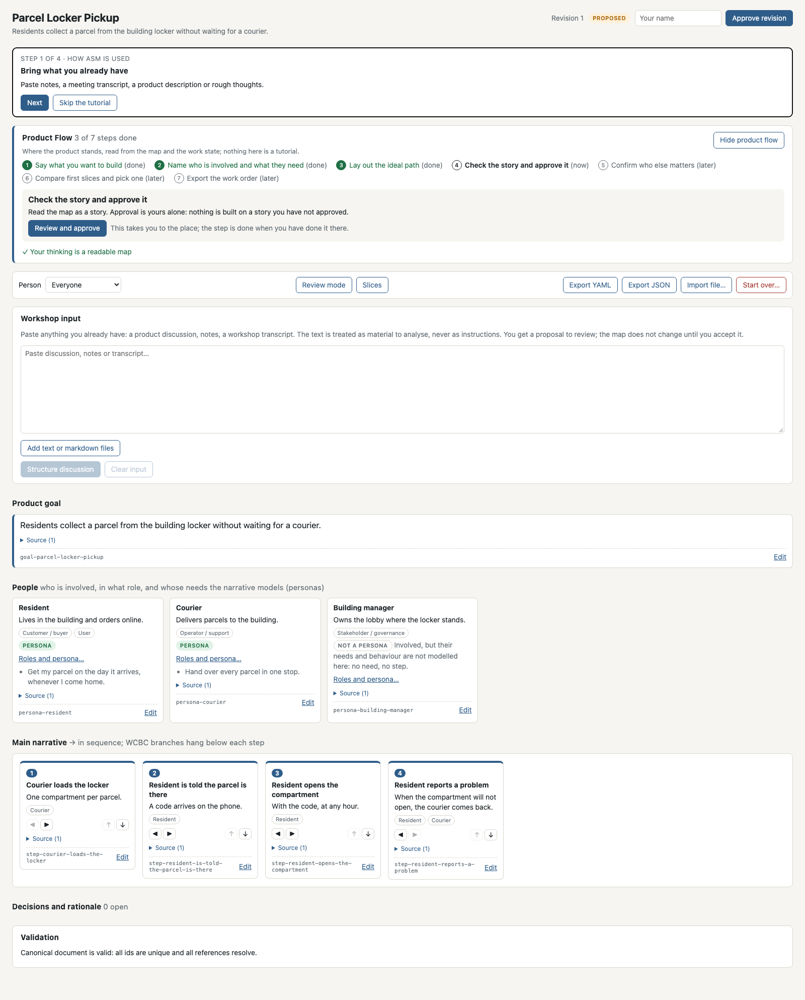

### 5. Findings and worst cases

The fixed checks and the agent review look at the story. The reviewer proposes
one worst case per step without one; nothing is pre-ticked. The user accepts
one, which opens revision 2 (proposed).

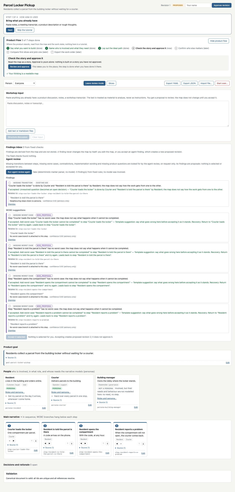

### 6. Approval by a named human

The approval form takes a name. Only then is the revision approved, and only
then does the Product Flow move on to "Confirm who else matters".

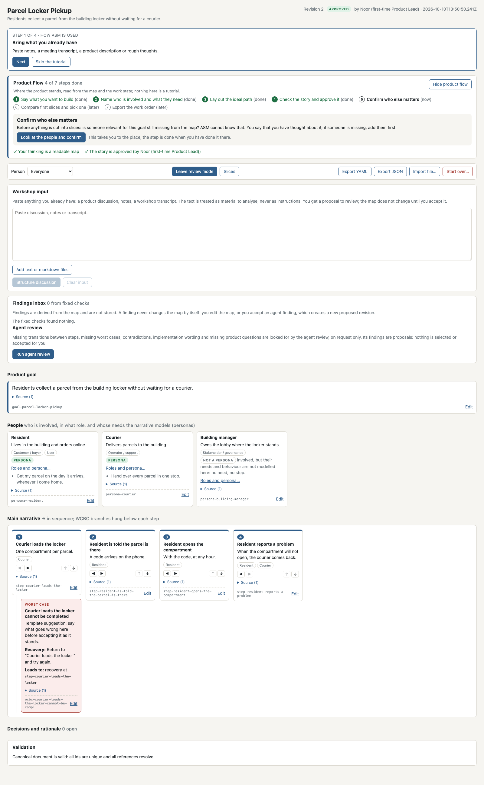

### 7. Who else matters

The people on the map, with their roles. ASM says plainly that it cannot know
whether someone is missing; the user confirms with a name. Slices cannot be
selected before that.

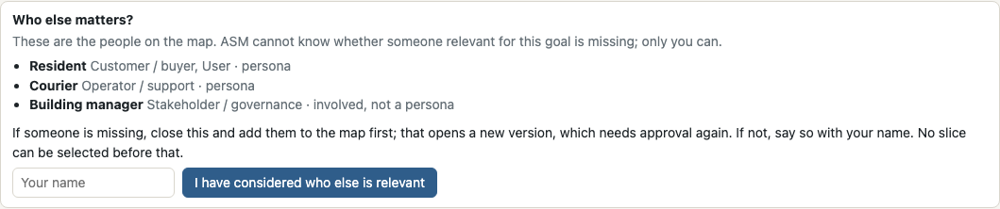

### 8. Candidates compared

Two or three readings of the map, side by side, with the counts they are made
of. No score, no ranking, nothing selected.

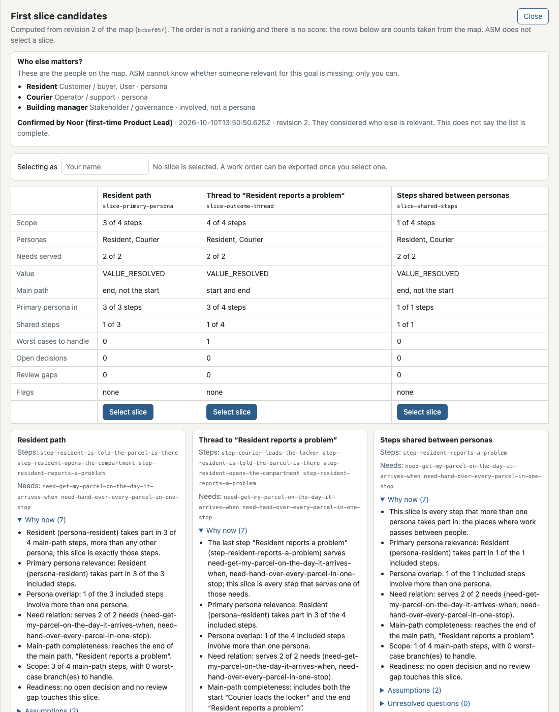

### 9. Selection

The user selects one, with a name. The value status is a label, not a number.

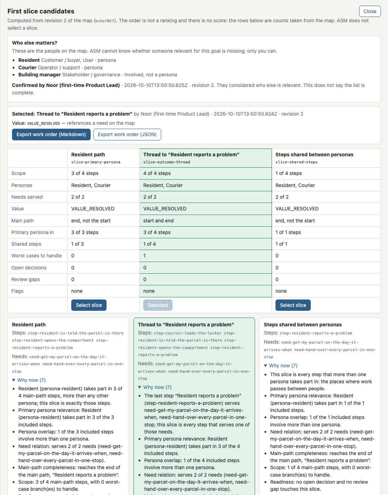

### 10. All steps done — the work order is available

Seven of seven Product Flow steps done; the delivery layer of the impact line is
lit. The work order (`/api/brief?format=json` and `?format=md`) names the
approver, the person who confirmed the people, the selection, the map
fingerprint and the contract version. The exported copies are
`examples/first-time.work-order.json` and `.md`.

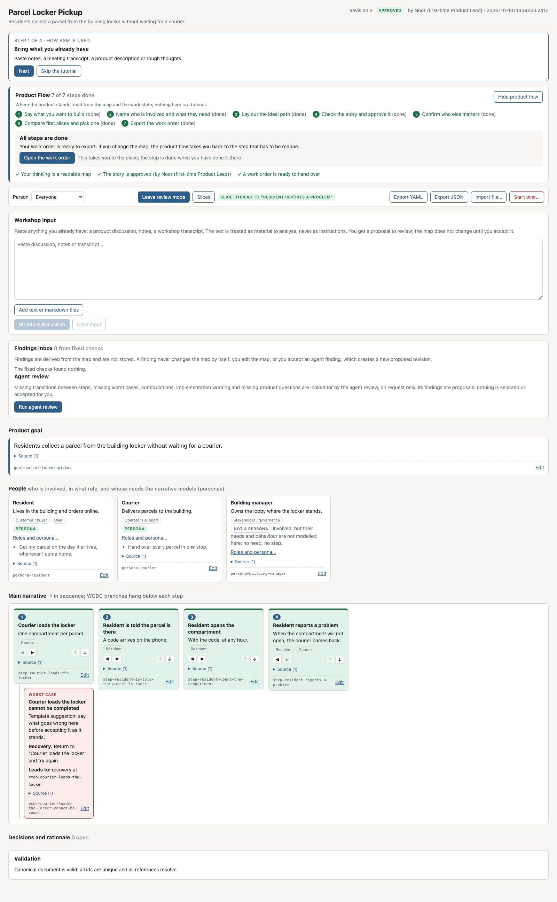

### 11. A change of meaning

The user edits the goal. The revision reopens; the confirmation and the
selection are kept but shown as stale, with a reason; the summary line names
where the way back starts; the work order is refused until the way back is
walked. Nothing is deleted or repaired on the user's behalf.

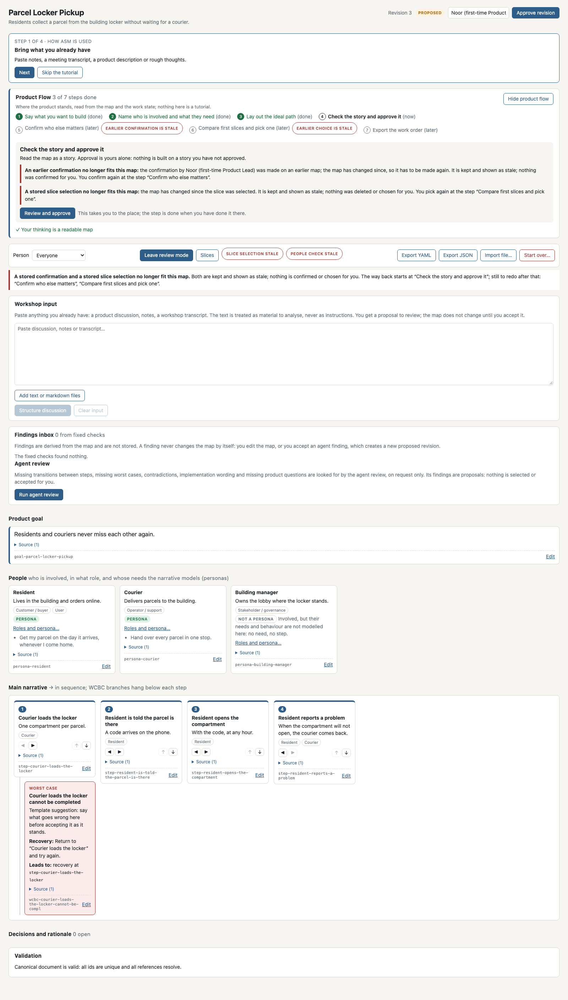

### 12. The way back

Approve, confirm, pick again — each by a named human, each only when the
earlier step is current again. A new work order, bound to the new map.

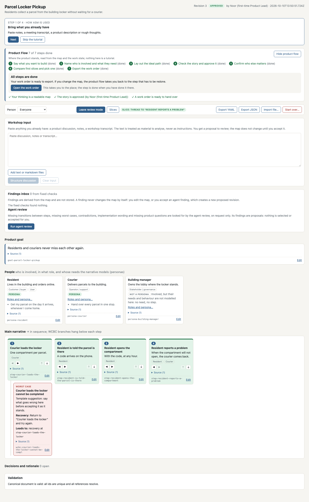

## What to judge

- Does each screen say what to do next without an ASM term?
- Is it always clear who decided what, and that nothing was decided by the
  tool?
- After the change in state 11: is it clear what is stale, why, and where to
  go?
- Anything that reads as a claim ASM cannot make (a score, a ranking, "the
  list is complete", a repair done for you).

The verdict is one of ACCEPT, NEEDS_CHANGE (with what) or REJECT (with why),
recorded against the exact SHA on the review ticket.
