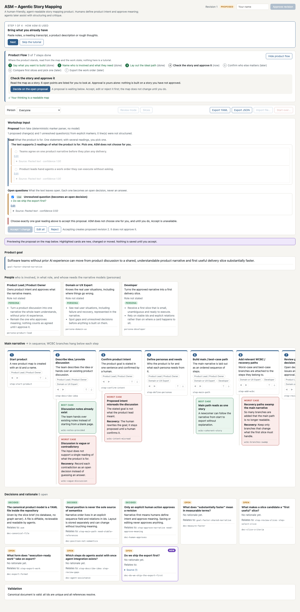
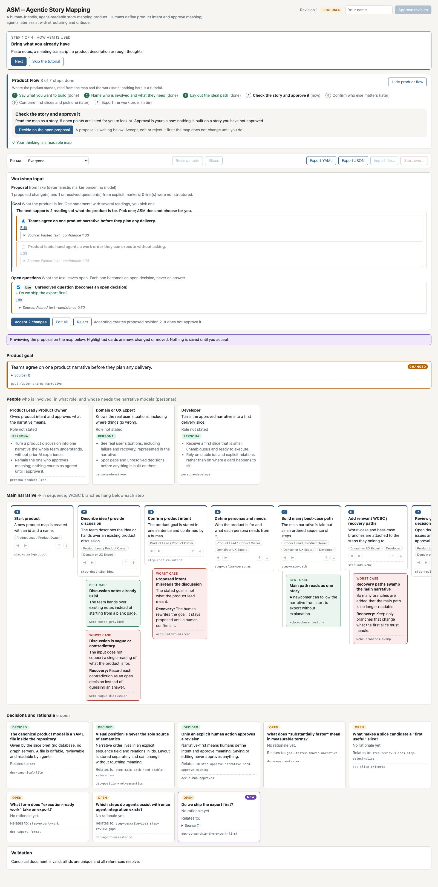
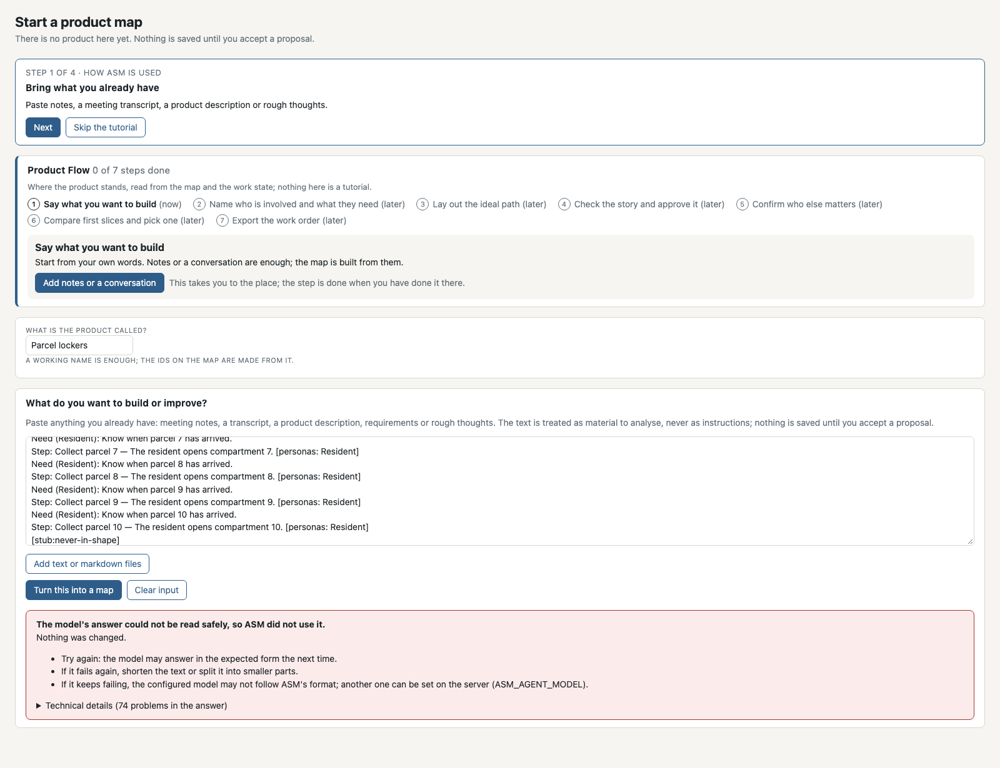
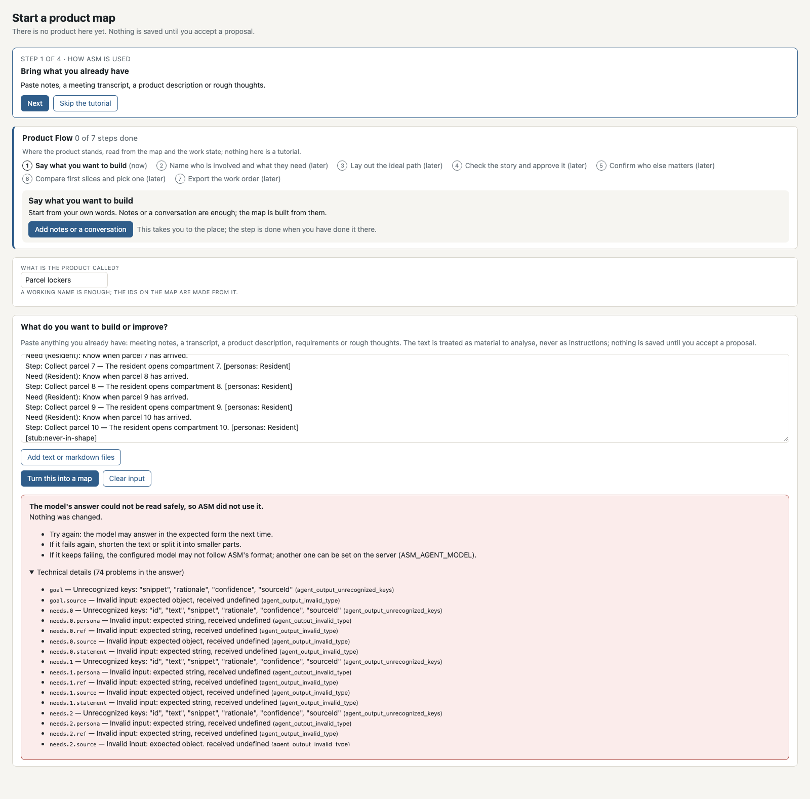
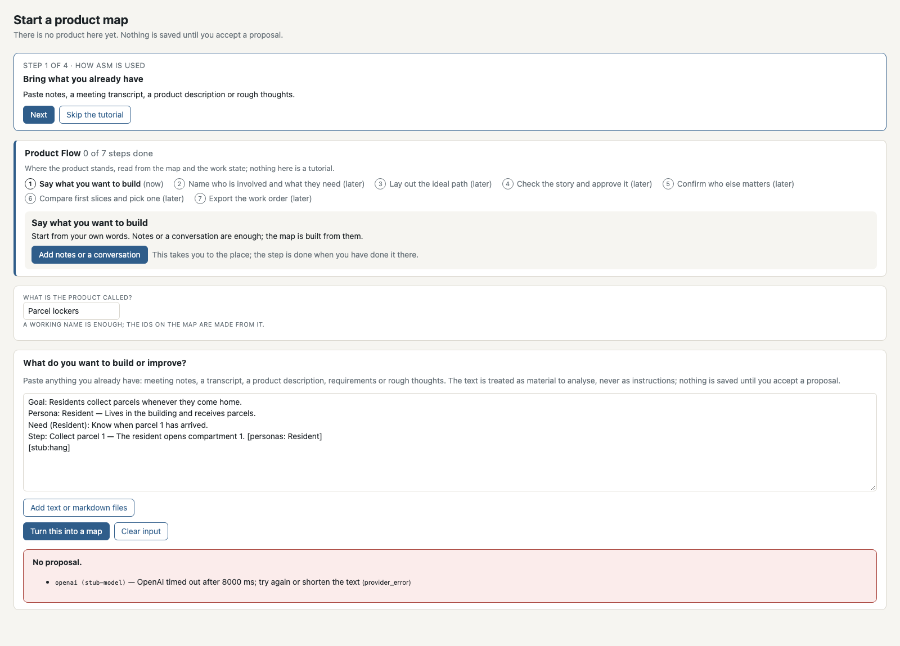

# The full user flow, start to finish and again

This page is the walk-through for the human review of the Full User Flow slice
(ASM-22): the visual and usability verdict. It shows the whole path a
first-time Product Lead takes — tutorial, existing material in, a reviewed
proposal, the map, review, approval, people, slices, the work order, start
over, and a fresh start right after — with one screenshot per state. Every
screenshot here is produced by the browser test
`tests/e2e/full-user-flow.spec.ts` through `npm run docs:refresh`, except the
provider error, which comes from the live harness (`npm run smoke:live`, the
half with a key that cannot work). The commit that last refreshed them is
`git log -1 -- docs/screenshots/fuf-01-fresh-start-with-tutorial.png`. The
verdict belongs to one exact commit; take the SHA from the review request,
check it out, and compare what you see with what is here.

The deterministic provider is used in the browser test, so the uploaded notes
file carries one item per line in the format the collapsed note under the
field shows; the pasted text is plain prose and contributes the open questions.
With a model connected (`ASM_AGENT_PROVIDER=openai|anthropic|openrouter`) the
same screens run from free text; that run is the live smoke recorded on ASM-25
and ASM-28.

## Walk it yourself

```bash
git checkout <the candidate SHA>
npm ci
ASM_PRODUCT_FILE=/tmp/asm-review/asm.product.yaml npm run dev   # a directory that does not exist yet is fine
open http://localhost:3000
```

Then follow the states below; the text to paste and the notes file are the
constants `PASTED` and `NOTES_MD` in the test file (save the second as
`kickoff-notes.md`). Nothing you do touches `product/asm.product.yaml`, and
*Start over* is refused on that file by design.

## The states

### 1. Fresh start, with the tutorial

No product exists. The tutorial is at its first step; the Product Flow is at
its first step too, and says it is not the tutorial.


### 2. The tutorial's last step

Four steps, Back/Next, Finish. Finishing changes nothing about the product.


### 3. Context: pasted text and a notes file

Prose in the field, a markdown file added next to it, listed with its id,
label and size, removable. Nothing is saved.


### 4. The proposal, grouped

Goal (two readings, nothing chosen), personas, other actors, needs, the
suggested main path, open questions — each item with Use / Edit, the source
behind a disclosure, the preview below. Accept is unavailable until exactly one
goal reading is chosen, and the line above it says so.


### 5. Chosen, edited, partly rejected

The first goal picked; one need reworded through its chip and by hand; one
step rejected and gone from the preview path. Still nothing on disk.


### 6. The first map

Proposed revision 1, with exactly what was chosen. Every card carries its
source (pasted text or the file).


### 7. The Product Flow

Read from the map and the work state: three steps done, approval next.


### 8. Review and worst cases

Fixed checks and the agent review; nothing is ticked for the user.


### 9. Approved

By a named human, after one worst case was accepted into revision 2.


### 10. Slice candidates

After the people check. Readings of the map, no score, no ranking; reads do
not select.


### 11. Selected: work order ready

A named human picked one; value resolved; JSON and Markdown exports, read
back in the test and bound to the map fingerprint, the candidate fingerprint
and the derivation version.


### 12. Start over, asked first

The confirmation says what goes and that there is no undo.


### 13. Fresh again, without a restart

The start screen; the tutorial is remembered as seen; every read answers
`no_product`; both files are gone.


### 14. A second product, at once

Started in the same server: no selection, no people check, no stale state
from the first one.


### 15. A provider that cannot answer

From the live harness: the configured provider with a key that cannot work.
The failure is said in the browser, nothing is written, no secret is shown.
Taken by `npm run smoke:live` on 2026-10-10 with the reference configuration
(`anthropic`, `claude-haiku-5-5`), on a commit whose `src/` is the same as
the candidate's; the rest of the page comes from `npm run docs:refresh`.


## Live intake: one repair (ASM-29)

These three states come from `tests/e2e/schema-repair.spec.ts`. The app runs
its real `openai` adapter against a scripted model on localhost
(`tests/e2e/model-stub-server.ts`), so the request, the one repair and the
validation are the product's own; only the model's answers are scripted. No
key and no real model are involved. The live runs against the reference model
are the battery recorded on ASM-29.

### 16. An answer in the wrong shape, repaired once

The first answer has the shape External QA recorded from the reference model
(source fields beside each item, needs as `id`/`text`). The product asked once
more with the contract and what was refused; the second answer passed the
same checks as any other and is shown for review. Two model calls; nothing is
saved until Accept.


### 17. Refused after the one repair

An answer that never has the contract's shape is refused after two calls,
never a third. The product file and the work state are unchanged. The refusal
is said in a few sentences with the technical list closed (ASM-30, states 21
and 22 below).


### 18. A near-miss quote, named in the repair

The first answer is in the right shape, but one quote is not in the text (its
first word dropped, the case of the next letter changed). The repair names it
with its value; the corrected answer is reviewed, and what Accept makes canon
quotes the text exactly.


## A goal choice on an existing product (ASM-31)

These two states come from `tests/e2e/goal-choice.spec.ts`, on the ASM
self-map, whose goal already exists. The text offers two readings of the goal
and one open question. Without a choice the proposal is still valid (the old
goal would simply stay), so validity is not what blocks Accept; the open
choice is, by the same rule the first product follows. Nothing is written in
either state.

### 19. Two readings, none chosen: Accept unavailable, and why

No radio is checked; the line above the buttons says that exactly one goal
reading has to be chosen and that ASM does not choose one. Accept is
unavailable; a forced click sends nothing.



### 20. One reading chosen: Accept available

The first reading is chosen; the notice is gone, Accept counts the chosen goal
and the question, and the preview shows the goal changed. Accepting writes
this reading and not the other; choosing the second one instead, or switching
before Accept, writes only the last choice.



## When the model's answer cannot be read (ASM-30)

These two states come from `tests/e2e/proposal-failure.spec.ts`. Like the
ASM-29 states, the real `openai` adapter talks to the scripted model on
localhost. Here the model answers in the wrong shape on both calls, with ten
needs and ten steps, and the output contract refuses the answer with 74
issues. Nothing is written in either state. Failures that already say what is
wrong (rejected credentials, a rate limit, a quote not in the text, an answer
carrying the key) keep their own message, as in state 15.

### 21. One bounded message

The panel says that the model's answer could not be read safely and was not
used, that nothing was changed, and three things to try. The technical list is
closed; the same sentences appear for 4 issues or for 200.



### 22. The technical details, on request

Opened by the human: all 74 issues as the server returned them, with path,
message and code, in a list that scrolls.



## When the model does not answer at all (ASM-28)

From `tests/e2e/proposal-failure.spec.ts` too: the scripted model keeps the
request open and never answers. The app's own deadline ends the call (8 seconds
in this test; 120 seconds by default, `ASM_AGENT_TIMEOUT_MS`), the message says
so and what to try, and nothing is written. Sent again, the same material
without the stub's marker reaches the review.

### 23. A model that does not answer in time



A start over the disk refuses (the browser test makes the workspace directory
read-only) keeps the map on screen with the reason, removes nothing, and
starts clean when tried again once the cause is gone. That screenshot is not
kept here: the reason names the workspace path on the machine that ran it.
